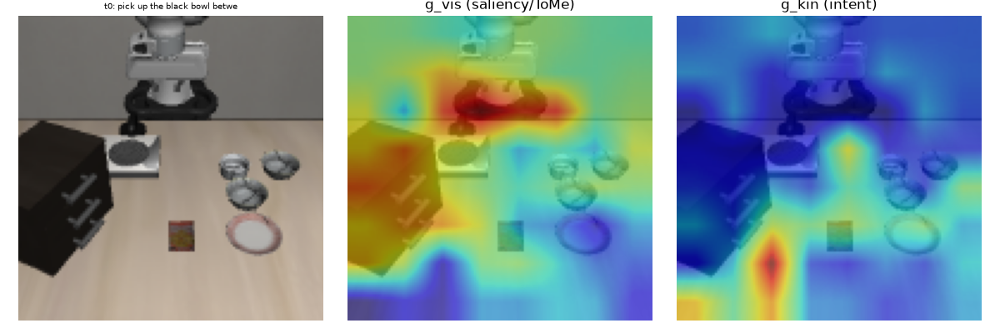
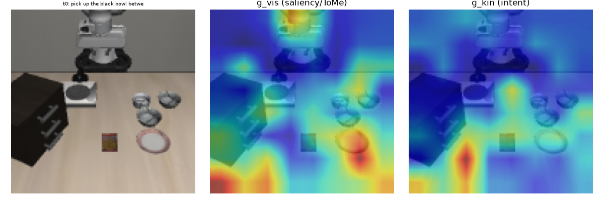
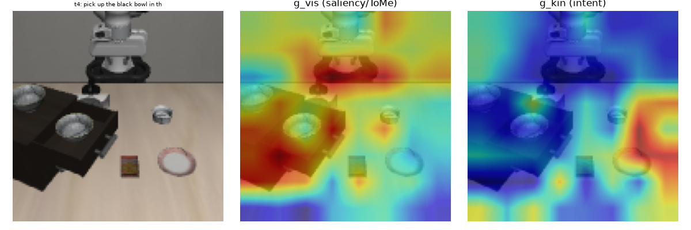
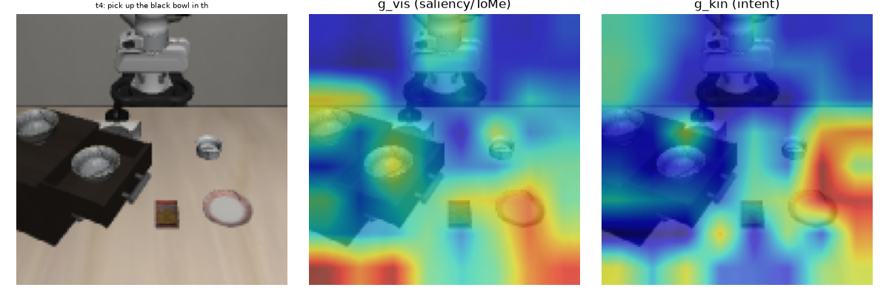

# ProMerge — Intent-Guided Visual Token Compression for Lightweight VLA (a documented negative result)

> **Research log, not a product.** This repo is an honest, end-to-end study of one
> idea — *can a lightweight, VLM-free Vision-Action policy use intent-guided visual
> token compression to stay accurate while running fast on LIBERO manipulation?*
> The short answer, after a full set of controlled experiments, is **no**, and the
> interesting part is **why**. Full write-up: **[NEGATIVE_RESULT.md](NEGATIVE_RESULT.md)**.

## The question

Heavy VLA pipelines (OpenVLA-7B, π0, ThinkProprio w/ Florence-2 + DiT) are accurate
but slow. I wanted to know whether a **ViT-Small + ACT** backbone — no 7B VLM — could
(a) follow language by **compressing visual tokens under instruction guidance** and
(b) run at high control frequency, trading a little success rate for a lot of speed.

## What I built

- A 6-variant LIBERO benchmark harness (monolithic ACT, random prune, ToMe, ProMerge
  intent-gate, ThinkProprio reimpl., FiLM) with a **suite-switchable** runner
  (spatial / object / goal / long) and env-controlled ablation switches.
- A `PerceptualGatekeeper` that fuses a **top-down intent gate** (instruction →
  visual tokens) with a **bottom-up saliency gate**, then soft-merges tokens (ToMe).
- Open-loop action-chunk execution aligned with the OpenVLA-OFT LIBERO protocol,
  attention visualizations, and a 3-seed evaluation protocol.

## What I found (the honest part)

| Config | LIBERO-Spatial success |
|---|---|
| Pure saliency merge (ToMe) | **73%** |
| ProMerge intent-gate (best single run) | 75.5% → **60.2% (3-seed avg)** |
| + fixed saliency / small-init (variance reduced, ceiling unchanged) | ~65% |
| CT-VAM (full tokens, no compression — literature) | 82% |

Across **3 suites × 3 seeds**, intent-guided compression **never reliably beats a
parameter-free saliency merger**, and is far behind full-token methods. It is not a
tuning problem — it is the idea:

1. **Token compression isn't the "cerebellum's" job.** Deciding *where to look* is
   top-down attention + saliency (cortex/colliculus), not low-level execution.
   The no-VLM methods that *do* work (CT-VAM, VITA) **keep all tokens**.
2. **"Fast" optimizes the wrong axis.** In manipulation, success rate is the binding
   constraint; the compression trades success for speed unfavorably.
3. **No-VLM + token compression has no reliable grounding signal** to select tokens
   by, so compression mostly destroys information.

## Diagnostics worth reading

- The **saliency gate was inverted**: `self_attn.sum()` scored *background
  homogeneity* (the big dark cabinet lit up, not the target bowl). Visualizing the
  gates caught it; a cosine-uniqueness fix corrected the heatmaps. *(real bug found
  by looking at the attention maps, not the loss)*

  | Inverted `g_vis` (`self_attn.sum`) — fires on the dark cabinet, not the target | Fixed `g_vis` (cosine uniqueness) — fires on the distinctive small objects |
  |---|---|
  |  |  |
  |  |  |

  *Left column of each image = scene, middle = `g_vis` (saliency), right = `g_kin`
  (intent). Before the fix, "saliency" highlighted the large homogeneous cabinet;
  after, it shifts to the distinctive objects — but note `g_kin` (intent) still
  fails to localize the target, which is the deeper reason the method underperforms.*
- **Intent grounding never localized the target**: probing g_kin across instructions
  showed weak, non-target-specific responses — CLIP-text vs. ViT-vision features are
  not aligned enough for a no-VLM dot-product / cross-attention to ground language.
- **High seed variance (53–75%)** traced to random init of the intent filter;
  small-init reduced variance but not the ceiling.

## Why this is here

Most of the value of a research project is in the reasoning, not the final number.
This repo documents the full loop — hypothesis → implementation → failure →
diagnosis → re-test → accepting a robust negative result — including the bugs I
found and the literature (CT-VAM, LightVLA, ThinkProprio, VITA) that explains why
the idea sits in a dead cell. The harness, ablation switches, and 3-seed protocol
are reusable.

## Repo layout

```
src/detr/models/perceptual_gatekeeper.py   # intent + saliency gating, ablation switches
src/detr/models/vit_backbone.py            # ViT-Small + CLIP-ViT backbones, mid-layer pruning
experiments/libero_spatial/                # suite-switchable train/eval on LIBERO
baselines/                                 # the 6 variants
NEGATIVE_RESULT.md                         # full write-up + numbers
RESULTS_*.md                               # raw per-experiment logs (3-seed, cross-suite, sweeps)
```

## Reproduce

```bash
bash cloud/setup.sh                     # deps + LIBERO env (Linux/CUDA, EGL headless)
# train+eval the best config on a suite:
PROMERGE_GATE=kin PROMERGE_GVIS=uniqueness LIBERO_SUITE=libero_spatial \
  python experiments/run.py --experiment libero_spatial --baseline promerge_film --mode train
```
